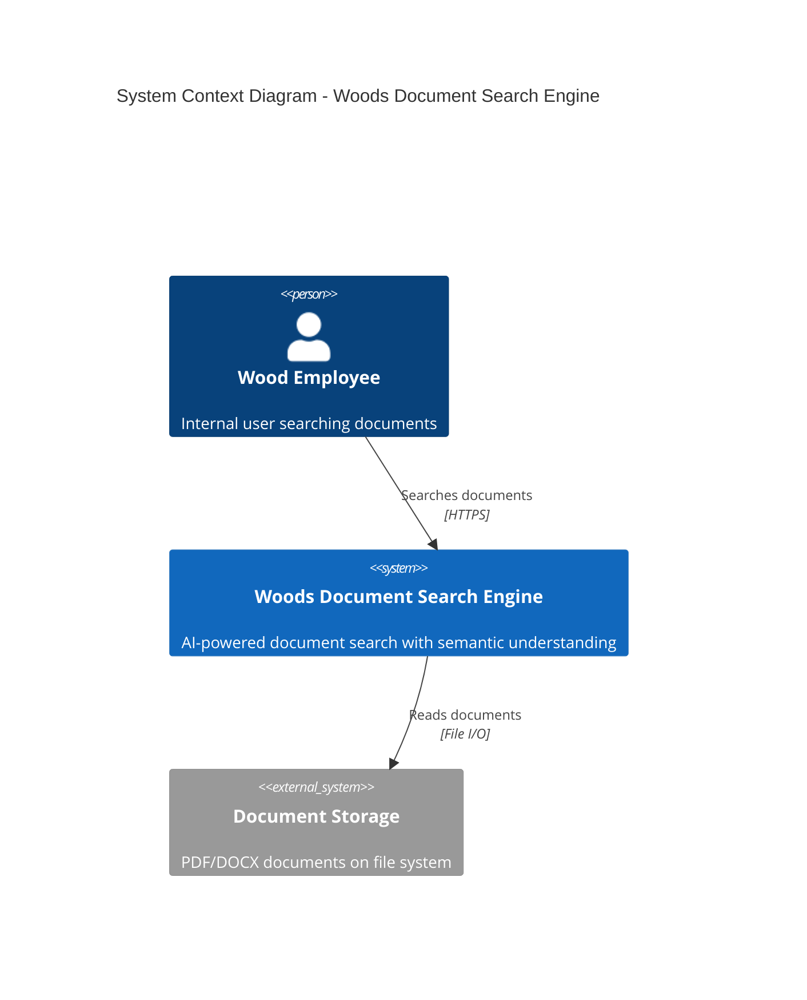
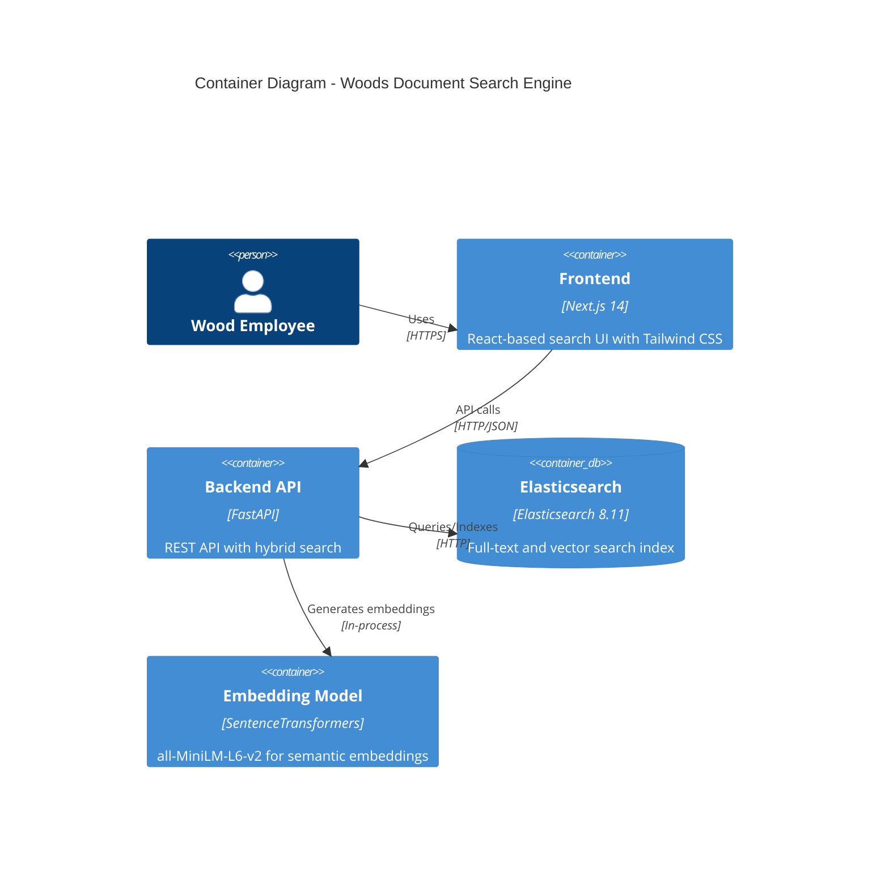
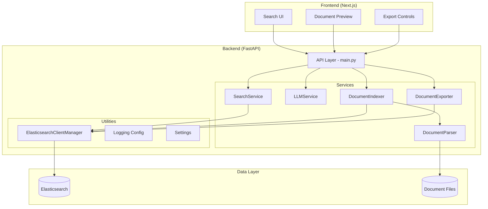
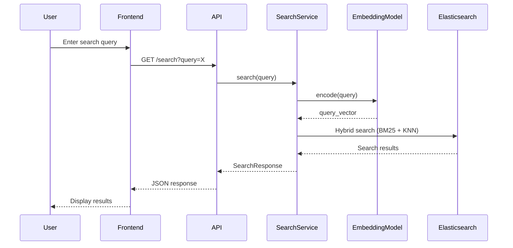
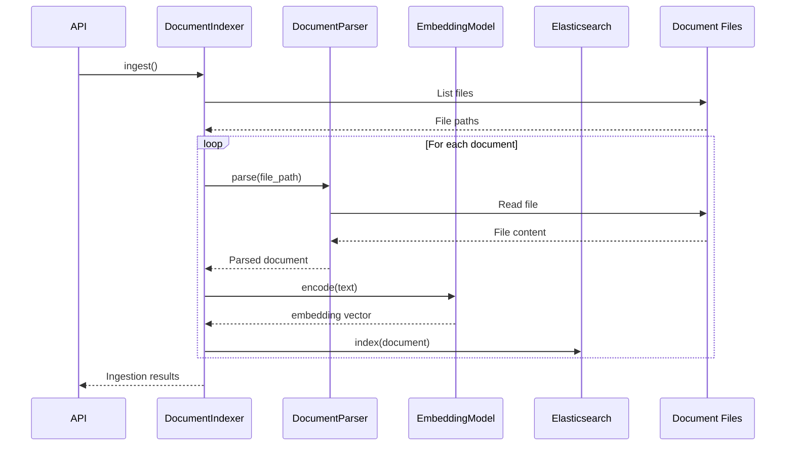
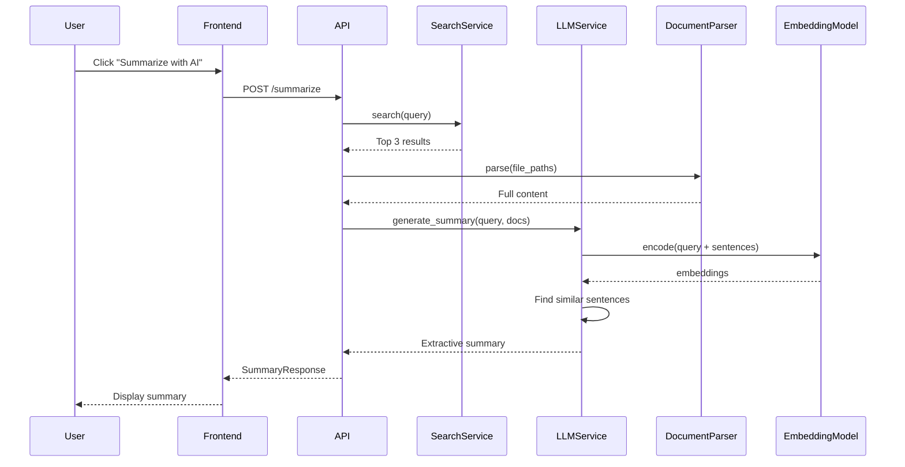

# Woods Document Search Engine - Architecture

This document describes the software architecture of the Woods Document Search Engine, an AI-powered internal document search solution.

## System Context



## Container Diagram



## Component Diagram



## Data Flow

### Search Flow



### Document Ingestion Flow



### Summarization Flow



## Technology Stack

| Layer | Technology | Purpose |
|-------|------------|---------|
| Frontend | Next.js 14 | Server-side rendering, routing |
| UI | React 18 | Component-based UI |
| Styling | Tailwind CSS | Utility-first CSS |
| Backend | FastAPI | Async REST API |
| Search | Elasticsearch 8.11 | Full-text + vector search |
| ML | SentenceTransformers | Semantic embeddings |
| Parser | pdfplumber, python-docx | Document extraction |
| Export | ReportLab, python-docx | PDF/DOCX generation |
| Container | Docker Compose | Multi-service orchestration |

## Key Design Decisions

### Hybrid Search Architecture

The search combines BM25 keyword matching with semantic vector search:
- **BM25**: Fast, interpretable, great for exact matches
- **KNN Vector Search**: Captures semantic meaning, handles synonyms
- **Combined Score**: Weighted fusion for best of both

### Extractive Summarization

Uses embedding similarity for extractive summarization (not LLM generation):
- No API costs or external dependencies
- Deterministic, reproducible results
- Fast response times
- Privacy-preserving (all processing local)

### Singleton Elasticsearch Client

Connection pooling with retry logic prevents connection exhaustion and handles transient failures gracefully.

## Directory Structure

```
woods-document-search-engine/
├── backend/
│   ├── app/
│   │   ├── ingestion/          # Document parsing, indexing
│   │   ├── search/             # Search, summarization services
│   │   ├── export/             # Export to PDF/DOCX/CSV
│   │   ├── utils/              # Shared utilities
│   │   ├── config.py           # Pydantic settings
│   │   ├── models.py           # Data models
│   │   └── main.py             # FastAPI application
│   ├── tests/                  # Test suite
│   ├── requirements.txt
│   └── Dockerfile
├── frontend/
│   ├── pages/                  # Next.js pages
│   ├── styles/                 # CSS styles
│   ├── package.json
│   └── Dockerfile
├── documents/                  # Source documents
└── docker-compose.yml
```

## Deployment

### Development

```bash
docker-compose up -d
```

### Production

Use `docker-compose.prod.yml` with:
- Resource limits
- Health checks
- Production environment variables
- No hot-reload
